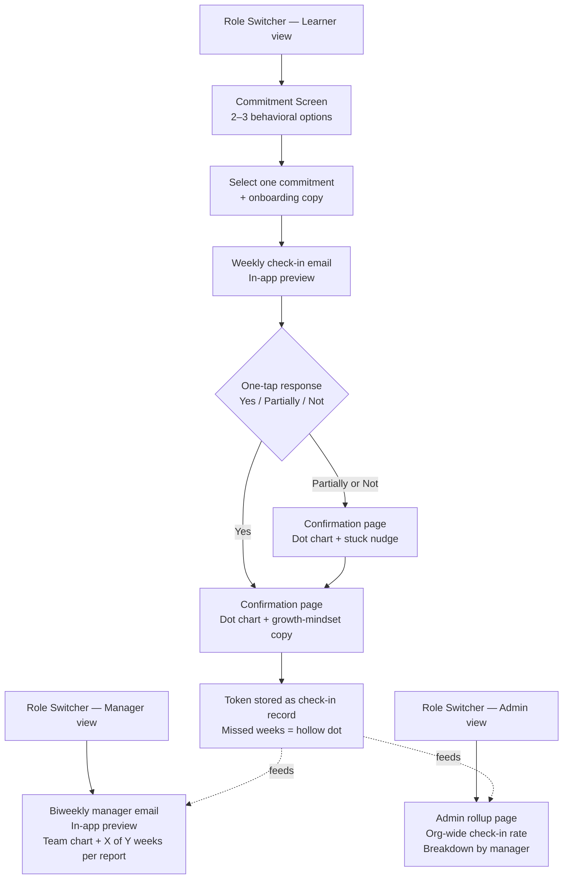

# Minimum Viable Product (MVP) Definition

## 1. The Core Problem

Post-training engagement collapses to <5% because reminder emails require zero action and create no visible pattern. The MVP must prove that a **frictionless one-tap weekly loop** — with honest pattern visibility — can sustain behavior practice where passive reminders fail.

---

## 2. Minimum Feature Set

- [ ] **Role switcher** — Learner / Manager / Admin, no auth, seeded demo data pre-loaded
- [ ] **Commitment screen** — 2–3 hardcoded behavioral options (no AI label needed); learner picks one to start cycle
- [ ] **Onboarding copy** — inline, post-selection; sets expectation for weekly one-tap check-in, growth-mindset tone
- [ ] **Weekly check-in email** (in-app preview route) — "Did you practice [behavior] this week?" with Yes / Partially / Not this week one-tap links, token in URL, no login
- [ ] **Check-in confirmation page** — renders immediately on tap; shows dot chart (QuickChart PNG or inline HTML) of all elapsed weeks + plain "X of Y weeks reported" summary; growth-mindset copy after response
- [ ] **Stuck nudge** *(non-optional — core to the learner loop)* — skippable prompt immediately after Partially/Not: "Feeling stuck? A quick note to [manager] can help"; handles the vulnerable moment rather than dropping it
- [ ] **Missed week logic** — hollow dot for no-response weeks; never auto-filled; no follow-up email
- [ ] **Manager status email** (in-app preview) — each direct report's commitment, "X of Y weeks" ratio, team activity chart; biweekly cadence (demo triggers it manually)
- [ ] **Admin rollup page** — single headline metric ("X% org-wide check-in rate"), breakdown by manager from seed data

---

## 3. The Cutting Room Floor

| Cut | Why |
|---|---|
| Chart embedded in *subsequent weekly emails* | Chart on confirmation page is the core "aha." Embedding in every outbound email adds QuickChart calls per send, image-blocking risk, and build time for marginal demo value. |
| **Live Resend send** *(v2)* | In-app preview routes are sufficient to demonstrate the email design and flow. Live send proves the pipeline but adds deliverability risk (default domain → spam) with no demo-narrative payoff that the preview doesn't already cover. |
| "AI-labeled" suggestion on commitment screen | PRD already mandates seeded/mock data. Labeling it AI adds zero functionality and no demo credibility. Three hardcoded options suffice. |
| Manager encouragement one-tap (P1) | Nice signal, but the manager email is already a stretch goal for the demo window. Encouragement adds a new response path with no upstream payoff in the prototype. |
| Re-assessment countdown (P1) | Static date math with no integration; easy v2 add. Zero hypothesis value in the prototype. |
| "Falling behind" threshold labels on manager/admin views | PRD explicitly deferred this. Ratio text is sufficient interpretation. |
| Email confirmation/verification for live send | Adds friction to the demo; out of scope per PRD. |

---

## 4. Simplest Technical Approach

- **No auth anywhere.** Token-in-URL for one-tap check-in links (e.g., `/checkin?token=abc`). Role switcher is a simple query param or nav toggle.
- **Seed data first.** Hard-code 3 learners, 2 managers, 1 admin in a single seed file. Wire all views to this data before wiring any form submissions.
- **Chart: QuickChart PNG via URL.** Build the chart URL server-side; embed as `` with a plain-text fallback. No client-side charting library needed. Use the same URL pattern for both the confirmation page and manager email.
- **Email:** In-app preview routes (plain HTML/JSX) built first; live Resend send is deferred to v2.
- **Manager email cadence:** No cron needed for the prototype. Trigger via a `/preview/manager-email` route and a single manual live-send button.
- **DB:** Neon Postgres with Drizzle. Simple schema: `learners`, `commitments`, `checkins`. Seed on deploy.

---

## 5. User Validation

The demo itself is the validation mechanism. The reviewer must be able to:

1. Pick a commitment as a learner
2. Receive (preview + live send) the weekly check-in email
3. Tap Yes/Partially/Not and see the dot chart immediately on the confirmation page
4. Switch to Manager and see the biweekly status email with team chart
5. Switch to Admin and see the org-wide check-in rate

Success signal: reviewer can complete the end-to-end loop without explanation, and the live Resend send lands in their inbox.

---

## MVP Reality Check

**What is underestimated?**
- **Token-in-URL one-tap flow** — stateless auth-free link handling is easy to get wrong. The token must map to a learner + week without a session. Test early.
- **QuickChart in email** — image blocking in Gmail/Outlook is real. The plain-text fallback (`"4 of 5 weeks reported"`) must render above the image, not below it.
- **Seed data coherence** — all three role views need to feel like the same org. Bad seed data breaks the demo narrative harder than a missing feature.

**The TRUE Minimum (if time runs out):**
Role switcher → learner picks commitment → in-app weekly email preview → one-tap check-in → confirmation page with dot chart + stuck nudge. Manager email as in-app preview only. Admin rollup as a static page with seeded numbers.

---

## Core Flow Diagram

